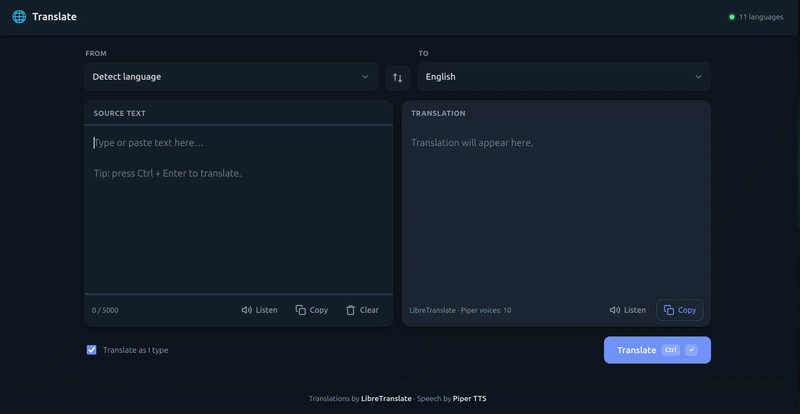

# 🌐 Translate Tool

A simple translation tool: type text, pick languages, get the translation — with a
copy button and text-to-speech on both panels.

- **UI** — plain HTML / CSS / JavaScript, no frameworks, no build step
- **Translation** — [LibreTranslate](https://libretranslate.com) (open-source, self-hostable)
- **Speech** — [Piper TTS](https://github.com/OHF-Voice/piper1-gpl) (offline neural voices)
- **Backend** — [FastAPI](https://fastapi.tiangolo.com) + Uvicorn, with interactive API docs

## Demo



## Quick start

```bash
./setup.sh      # creates .venv, installs deps + voices, starts the LibreTranslate container
docker start libretranslate 
./run.sh        # http://localhost:3000
```

`setup.sh` is safe to re-run — it skips anything already installed.

Interactive API docs are served at `/docs`, the OpenAPI schema at `/openapi.json`.

## Shutdown

Press CTRL+C to quit

```bash
docker stop libretranslate 

```
## Requirements

| Need | Why | Check |
| --- | --- | --- |
| Python 3.10+ | runs the server and Piper | `python3 --version` |
| Docker | runs LibreTranslate locally | `docker --version` |

Docker is optional — see *Hosted LibreTranslate* below.

## How it works

```
browser  ──►  FastAPI  ──►  LibreTranslate  (HTTP, port 5000)
              (port 3000)  ──►  Piper       (in-process → WAV)
```

The browser only ever calls this app's own API. Routing translation through the
server keeps any API key out of the client and avoids CORS entirely.

| Endpoint | Purpose |
| --- | --- |
| `GET /api/health` | engine status + which languages have a Piper voice |
| `GET /api/languages` | language list (cached 10 min) |
| `POST /api/translate` | `{ q, source, target }` → `{ translatedText, detected }` |
| `POST /api/tts` | `{ text, lang }` → `audio/wav` |

Every error response is `{ "error": "..." }` — FastAPI's default `{ "detail": ... }`
bodies are rewritten in [`app/errors.py`](app/errors.py) so the frontend can read
one shape everywhere.

## Features

- Source/target pickers with **auto-detect** and a **swap** button that also
  swaps the text
- **Translate as I type** (debounced), or `Ctrl` + `Enter` / the Translate button
- **Copy** on both panels, with a fallback for non-HTTPS origins
- **Listen** on both panels — Piper renders the WAV server-side; click again to
  stop. Languages without a Piper voice fall back to the browser's built-in
  speech, so the button always does something
- Language choices persist in `localStorage`; responsive down to phone width;
  follows the OS light/dark theme

## Configuration

Everything lives in [`app/config.py`](app/config.py) and every value has an env
override. Copy `.env.example` to `.env`, or set them inline: `PORT=3001 ./run.sh`.

| Variable | Default | Meaning |
| --- | --- | --- |
| `HOST` | `127.0.0.1` | interface to bind |
| `PORT` | `3000` | port for this app |
| `LT_URL` | `http://localhost:5000` | LibreTranslate base URL |
| `LT_API_KEY` | *(empty)* | needed only by hosted instances |
| `LT_TIMEOUT_MS` | `20000` | give up on a stalled engine |
| `PIPER_VOICES_DIR` | `voices/` | where `.onnx` voices live |
| `PIPER_TIMEOUT_MS` | `60000` | give up on a stalled synthesis |
| `PIPER_MAX_LOADED_VOICES` | `3` | voices kept warm in RAM (~60 MB each) |

### Hosted LibreTranslate

No Docker? Get a key at [portal.libretranslate.com](https://portal.libretranslate.com):

```bash
LT_URL=https://libretranslate.com LT_API_KEY=your-key ./run.sh
```

The public instance requires a key — keyless mirrors are no longer reliable.

### Adding a voice

Pick one from the [voice catalogue](https://huggingface.co/rhasspy/piper-voices),
download it, and map it to a language code:

```bash
.venv/bin/python -m piper.download_voices --download-dir voices nl_NL-mls-medium
```

```python
# app/config.py
VOICES = {
    "nl": "nl_NL-mls-medium",
}
```

Restart the server. Anything unmapped still works — it just uses browser speech.

Regional codes fall back to the base language, so LibreTranslate's `zh-Hans`
resolves to the `zh` voice automatically.

## Troubleshooting

| Symptom | Fix |
| --- | --- |
| "Address already in use" | it's already running — open the page, or `kill $(lsof -ti:3000)`, or `PORT=3001 ./run.sh` |
| "engine offline" in the header | `docker start libretranslate`, then reload |
| First run is slow | LibreTranslate downloads language models on first boot; `docker logs -f libretranslate` |
| First Listen per language is slow | the voice model is loading; later requests reuse it |
| Listen falls back to browser speech | no Piper voice mapped for that language — see *Adding a voice* |
| One language silently uses browser speech | its download was cut short; a voice needs both `.onnx` and `.onnx.json`. Re-run `./setup.sh` |
| "Could not run Piper" | `./setup.sh` to (re)create `.venv` |

## Layout

```
├── app/
│   ├── main.py         FastAPI app: routes + static mount
│   ├── config.py       settings (env-overridable) and the voice map
│   ├── schemas.py      request/response models
│   ├── translation.py  LibreTranslate client (httpx, cached languages)
│   ├── tts.py          Piper synthesis with a warm voice cache
│   └── errors.py       uniform { "error": ... } responses
├── public/             UI — unchanged from the original build
│   ├── index.html
│   ├── styles.css
│   └── app.js
├── voices/             Piper .onnx models (gitignored)
├── requirements.txt
├── setup.sh            installs deps, voices, LibreTranslate
└── run.sh              starts the server
```

## Notes on the port from Node

The previous backend was a single dependency-free Node file. Behaviour is
unchanged — same endpoints, same JSON, same status codes, and `public/` is
byte-for-byte identical. Two things got better in the move:

- **Piper runs in-process.** The Node server spawned `python -m piper` per
  request, reloading a ~60 MB model every time. Voices are now loaded once and
  cached (LRU, bounded by `PIPER_MAX_LOADED_VOICES`), which took a repeat
  synthesis from ~2.8 s to ~0.45 s here. Synthesis is CPU-bound, so it runs in a
  worker thread and never blocks the event loop.
- **The API is typed and self-documenting** — Pydantic validates every request
  body, and `/docs` is generated from the same models.
